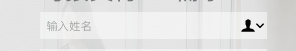

### 表单中不用flex布局使文字两端对齐（类似 flex 的 space-between）
```
td {
  text-align:center;
  text-align:justify;
  text-justify:distribute-all-lines;
  text-align-last:justify;
}

```
### 背景图与背景色共存的时候
```
div {
  background: url('../assets/gift-bg.png') no-repeat top center, linear-gradient(to bottom, #E6284E, #FC7D4F);
}

```
### 字体清晰度属性
```
text {
  -webkit-font-smoothing: antialiased;
}

```

### input标签 调起纯数字键盘
```
<!-- 键盘中带有*#号 -->
<input type="tel"  placeholder="请输入短信验证码" v-model="code">

<!-- 键盘中带*#不带号 -->
<input type="text"  placeholder="请输入短信验证码" v-model="code" pattern="[0-9]*">

```

### 鼠标移动到元素上显示不同光标
  cursor 属性规定要显示的光标的类型（形状） http://www.w3school.com.cn/cssref/pr_class_cursor.asp
```
{
  cursor: auto; // 默认箭头
  cursor: pointer; // 小手
  cursor: crosshair; // 十字线
  .......
}

```

### css三角形

```
div {
  width: 0;
  height: 0;
  border-left: 12px solid transparent;
  border-right: 12px solid transparent;
  border-top: 18px solid #FE9B20;
}

```

### 去除mac safari下input标签右边的联系人图标

```
input {
  input:focus::-webkit-contacts-auto-fill-button{opacity: 0;}
}

```

### css文本超出省略号显示
  单行文本超出
  ```
  text {
    overflow: hidden;
    text-overflow: ellipsis;
    white-space: nowrap;
  }

  ```
  多行文本超出
  ```
  {
    display: -webkit-box;
    -webkit-box-orient: vertical;
    -webkit-line-clamp: 3;  // 控制行数
    overflow: hidden;
  }

  ```
  常见结合属性：
  
    -webkit-line-clamp用来限制在一个块元素显示的文本的行数。 为了实现该效果，它需要组合其他的WebKit属性。
    display: -webkit-box; 必须结合的属性 ，将对象作为弹性伸缩盒子模型显示 。
    -webkit-box-orient 必须结合的属性 ，设置或检索伸缩盒对象的子元素的排列方式 。
